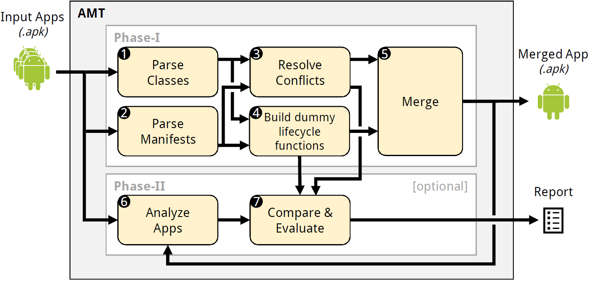

---
<p align="center">
	
</p>

# AMT
The *Android Merge Tool (AMT)* does what the name suggests: it merges arbitrary Android apps into a single merged app.
As input it takes a number of Android packages (.apk files) and outputs the merged app as one Android package.
Along with this primary output, a report is generated optionally.
It contains information about the properties (e.g. taint-flows) changed.

<p align="center">
	
</p>

An overview of the whole approach is illustrated in the figure above.
On the one hand, the first five steps (1 - 5) represent *Phase I*, the app merging process.
Multiple input apps are merged into a single merged app.
On the other hand, Step 6 and 7 stand for *Phase II*.
During this phase it is evaluated how accurately the merged app represents the input apps.
In order to guarantee accurately merged benchmarks Phase II becomes indispensable.
For more information please take a look at the associated [paper](t.b.a.) (see Publications).

## Usage
Two steps have to be completed in order to use AMT:  
- **Step 1: Configuration**  
The file *amt.properties* holds the AMT's configuration.
The following options can be configured:

| Parameter | Meaning |
| --------- | ------- |
| `androidPlatforms=/path/to/Android/sdks/platforms` | The path to the Android platforms directory |
| `apktoolPath=/path/to/apktool` | [ApkTool](https://github.com/iBotPeaches/Apktool) must be installed and this path has to point to the directory containing ApkTool's JAR file |
| `apktoolJar=apktool_2.3.4.jar` | Mostly dependent on ApkTool's version, the JAR's filename should be adapted here. |
| `aqlQuery=Flows IN App('%APP_APK%') USES 'FlowDroid' ?` | When run in *check* or *comparison* mode, an [AQL-Query](https://github.com/FoelliX/AQL-System/wiki/Questions) to execute must be defined here. |
| `comparisonAqlQuery=Flows IN App('%APP_APK%' \| 'COMBINE') USES 'FlowDroid' ?` | The query used for the comparison must be defined here. |
| `outputFolder=output` | Any output is stored in the specified directory |

- **Step 2: Launch**  
AMT can be accessed from the command-line as follows:
````bash
java -jar AMT-0.0.2.jar [optional launch parameters] [list of .apk files]
````
for example:
````bash
java -jar AMT-0.0.2.jar -comparison -d verbose -cfg myConfig.xml A.apk B.apk
````
This will launch AMT in comparison mode, shorten its output and use `myConfig.xml` as configuration for the underlying AQL-System.
All launch parameters are listed in the following table:

| Parameter | Meaning |
| --------- | ------- |
| `-check`  | Turns on the optional *check* mode |
| `-comparison`  | Turns on the optional *comparison* mode |
| `-c %FILE%`, `-cfg %FILE%`, `-config %FILE%` | This parameter can be used to specify a different config file for the underlying [AQL-System](https://github.com/FoelliX/AQL-System) (By default: *config.xml* is used) |
| `-debug "X"`, `-d "X"`, `-l "X"`, `-loglevel "X"` | The output generated during the execution of this tool can be set to different levels. `X` may be set to: `error`, `warning`, `debug`, `detailed`, `verbose` (ascending precision from left to right). |

## Publications
- *App Merging for Benchmark Speed-Up and Analysis Lift-Up* (Felix Pauck, Shikun Zhang)  
A-Mobile@ASE 2018 [https://ieeexplore.ieee.org/document/8967423](https://ieeexplore.ieee.org/document/8967423)

## License
AMT is licensed under the *GNU General Public License v3* (see [LICENSE](https://github.com/FoelliX/AMT/blob/master/LICENSE)).

## Contact
**Felix Pauck** (FoelliX)  
Paderborn University  
fpauck@mail.uni-paderborn.de  
[http://www.FelixPauck.de](http://www.FelixPauck.de)

## Links
- AMT requires ApkTool: [https://github.com/iBotPeaches/Apktool](https://github.com/iBotPeaches/Apktool)
- AMT uses the AQL and its system: [https://foellix.github.io/AQL-System](https://foellix.github.io/AQL-System)
- ApkCombiner is a very similar tool: [https://github.com/lilicoding/ApkCombiner](https://github.com/lilicoding/ApkCombiner)